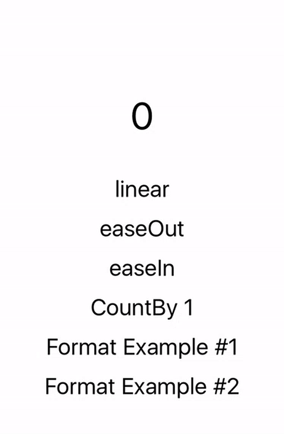
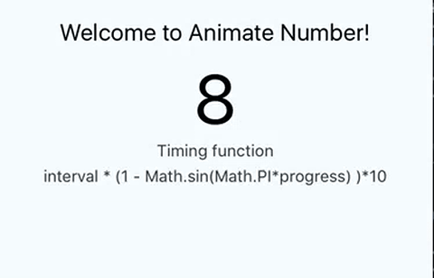

# react-native-animate-number [](https://badge.fury.io/js/react-native-animate-number) [](https://circleci.com/gh/wkh237/react-native-animate-number/)

Customizable react native component for number animations.



- [Examples](#user-content-exmples)
 - [Basic](#user-content-basic)
 - [Formatting](#user-content-formatting)
 - [Timing function](#user-content-timing-function)
 - [Counting](#user-content-timing-counting)
- [Props](#user-content-props)

## Installation

```shell
$ npm install react-native-animate-number
```

## Usage

```jsx
import AnimateNumber from 'react-native-animate-number'
```

## Examples

### Basic

The only required property is `value`, when this property changes, it automatically interpolates
value and performs animation.

```jsx

<AnimateNumber value={100}/>

```

### Formatting

You can customize text format by specifying `formatter` prop, this property must be a `function`.

```jsx

<AnimateNumber value={100} formatter={(val) => {
    return '$ ' + parseFloat(val).toFixed(2)
  }}/>

```

### Timing function

There're 3 built-in timing functions which are `linear`, `easeIn`, and `easeOut`.
It is also possible customize your timing function, see examples bellow.

#### Built-in timing function

```jsx

<AnimateNumber value={100} timing="linear"/>
<AnimateNumber value={100} timing="easeOut"/>
<AnimateNumber value={100} timing="easeIn"/>

```

#### Customized timing function

Customized timing function returns a `number` which represents the length of animation frame.

`interval`

Basic interval length of animation frame, default value is `14` ms. You can change this value by `interval` prop.

`progress`

A float number between 0 to 1, which means the progress of animation.

```jsx

<AnimateNumber value={200}
  countBy={1}
  timing={(interval, progress) => {
    // slow start, slow end
    return interval * (1 - Math.sin(Math.PI*progress) )*10
  }}/>

```

the above example will make an animation like this



### Counting

By default this component calculates value increment of each animation frame,
but you can customize this rule by set prop `countBy`.

```jsx

<AnimateNumber value={100} countBy={1} />

```

But keep in mind if the `countBy` value is relative small than `value`, the animation may persists for a very long time.
Like the following example, it will tasks 150 seconds to finish the animation.

```jsx

<AnimateNumber value={10000} interval={15} countBy={1} />

```

## Props

#### `value:number`(required)

The value of AnimateNumber component.

#### `countBy:number`(optional default to `null`)

Set this property to force the component's value increase/decrease by this number.

#### `interval:number`(optional default to `14`)

Base interval of each animation frame, in `ms`.

#### `steps:number`(optional default to `45`)

Set total frame number of animation, say, if interval is 14 and steps is 30, the animation will take 14x30ms to finish when it uses linear timing function.

#### `timing: 'linear' | 'easeOut' | 'easeIn' | () => number`

Custom timing function or use a default timing function.

#### `formatter: () => string`(optional)

This prop accepts a `function` which returns a `string` as displayed value.

#### `onProgress: () => void`(optional)

A function that triggers when text state has updated.

#### `onFinish: () => void`(optional)

A function that triggers when animation completes.
